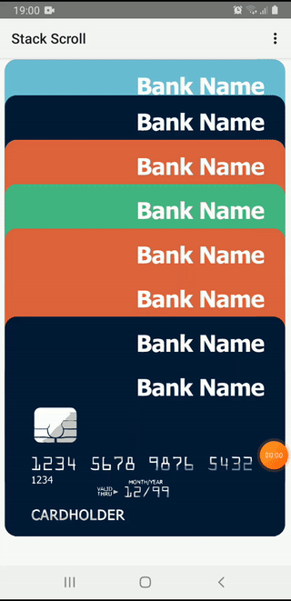

Stack Scroll Sample
===================================

===================================
#Compile
- Android Studio 4
- graddle 5.1.1

#Control:
- Drag: Scroll through cards.
- Double tap: Open a card.
- Long press: Add a card.

#Intergration:
- See StackingCardFragment.java